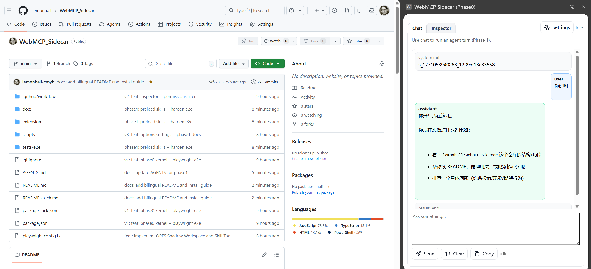
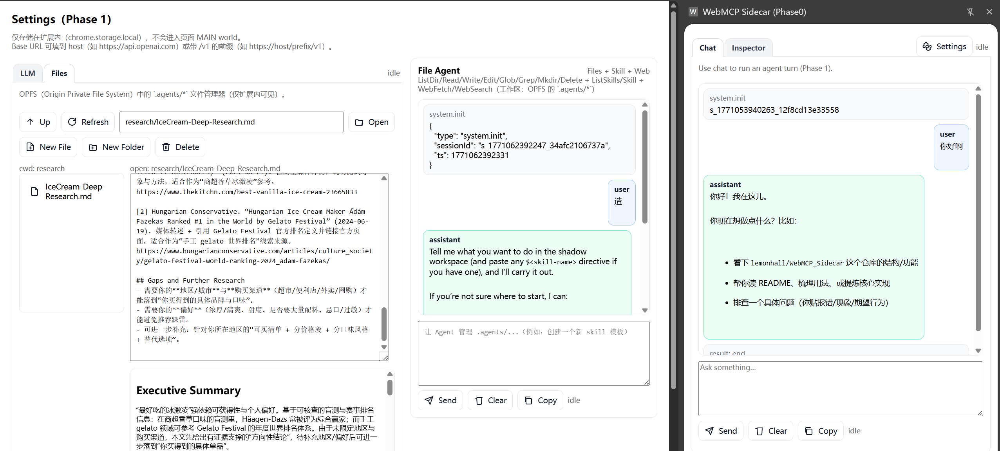
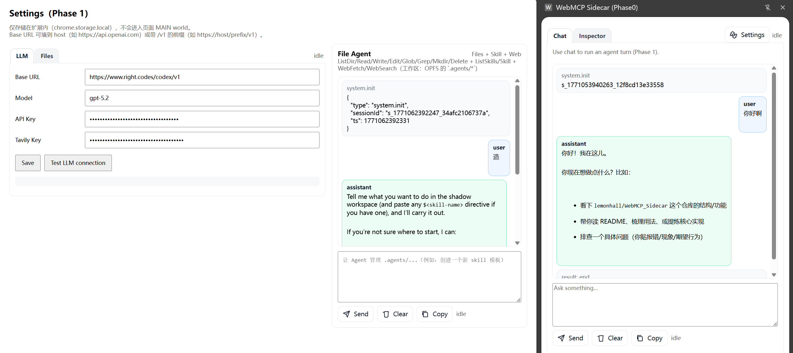

# WebMCP Sidecar（Chrome MV3）

WebMCP Sidecar 是一个 **Chrome 扩展**（Manifest V3 + Side Panel + Options/Settings），用于：
- 在当前网页里发现 **WebMCP 工具**（通过 `navigator.modelContext` / WebMCP demos 暴露）
- 在 Side Panel 的 **Inspector** 里调用这些工具，并展示结果
- 在 Side Panel 的 **Chat** 里运行一个基础 Agent：可用页面工具 + 本地 OPFS “影子工作区”工具 + Web 工具

English README: `README.md`

仓库地址：`https://github.com/lemonhall/WebMCP_Sidecar`

## 小白安装（开发者模式加载 unpacked 扩展）

本项目当前默认走 **开发者模式**（不考虑上架 Chrome Web Store）。

1) 下载源码
- GitHub 直接下载 ZIP 并解压，或 `git clone` 到本地目录，例如 `WebMCP_Sidecar/`

2) 打开扩展管理页
- 地址栏输入：`chrome://extensions`
- 右上角打开 **开发者模式（Developer mode）**

3) 加载扩展
- 点击 **加载已解压的扩展程序（Load unpacked）**
- 选择目录：`WebMCP_Sidecar/extension/`

4) 打开 Side Panel
- 点击扩展图标（建议先固定到工具栏）
- Chrome 会打开该扩展的 **侧边栏（Side Panel）**

## 现在有哪些能力

- **WebMCP Inspector（Phase 0）**：刷新工具列表、调用工具、展示调用结果
- **Chat Agent（Phase 1）**：
  - streaming 输出 + 历史记录
  - tool.use / tool.result 事件可见（tool.result 默认会截断，避免 UI 过长）
  - 侦测 URL 变化后自动重载 tools
  - 一键 Copy 整段对话 transcript
- **Web 工具**：
  - `WebFetch`（抓取 HTTP(S) 内容；默认禁止访问 localhost/内网，除非显式 `allow_private_networks: true`）
  - `WebSearch`（配置 Tavily Key 时优先走 Tavily；否则走 fallback 模式）
- **Skill（Meta Tool）+ OPFS Shadow Workspace**：
  - 扩展内部文件树：`.agents/skills/*`、`.agents/sessions/*`
  - `ListSkills` / `Skill` + 文件工具（`ListDir/Read/Write/Edit/Glob/Grep/Mkdir/Delete`）
  - 内建 skills 在首次调用 `ListSkills` / `Skill` 时会自动落盘到 OPFS（包含 `hello-world` / `deep-research` / `find-skills` / `brainstorming` / `skill-creator`）
- **Deep Research 工作流**：通过 `$deep-research` 技能指令 + `WebSearch` 产出带引用的调研稿（效果取决于模型）

## 截图

1) Side Panel — Chat + Inspector  


2) Inspector — Refresh / Call  


3) Options/Settings — LLM + Files（OPFS）  


## 快速验证（WebMCP 航班 Demo）

1) 打开 WebMCP demo：
- `https://googlechromelabs.github.io/webmcp-tools/demos/react-flightsearch/`

2) 在 Side Panel 切到 **Inspector**
- 点 **Refresh** 列出工具
- 选 `searchFlights`，点 **Call**

已验证可跑通入参：
```json
{"origin":"LON","destination":"NYC","tripType":"round-trip","outboundDate":"2026-02-14","inboundDate":"2026-02-21","passengers":2}
```

## Chat Agent（Phase 1）

Side Panel 的 **Chat** 具备：
- Streaming 输出
- tool.use / tool.result 事件可见（tool.result 默认会截断，避免 UI 过长）
- Tab 导航（URL 变化）后自动重载 tools
- Copy 一键复制整段对话 transcript

### 配置 LLM

打开扩展的 `Options/Settings`，填写：
- `baseUrl`
- `model`
- `apiKey`

Provider 期望是 **兼容 OpenAI Responses API** 的服务端。

### Skill（Meta Tool）+ OPFS Shadow Workspace

扩展内部用 OPFS 维护一个私有文件树（仅扩展可见）：
- `.agents/skills/*`
- `.agents/sessions/*`

内建技能会在首次调用 `ListSkills` / `Skill` 时自动落盘到 OPFS（包括）：
- `hello-world`
- `deep-research`
- `find-skills`
- `brainstorming`
- `skill-creator`

用法：在 Chat 输入 `$deep-research`（或任意 `$<skill-name>`）即可显式请求加载该 Skill。

## 展望（Roadmap）

这个项目会一直保持“先把内核做实，再逐步加能力”的节奏。接下来我希望把它做成一个真正好用的浏览器 Sidecar：

- **Shadow workspace 支持 Git**：在扩展内部工作区里做 status/log/diff/commit 等基础操作
- **find-skills + 自助安装**：让用户/Agent 可以把技能一键安装到 `.agents/skills/*`
- **Tab 自动化**：列出/切换/关闭 tab，打开 URL，做多 tab 工作流
- **DOM 读写**：安全读取页面 DOM；在用户明确意图下执行 DOM 写入/自动化
- **文章总结/提炼**：对当前页面做摘要、要点、提纲、关键引用提取
- **更好的 Agent UI**：把工具调用、事件流、结果卡片化，支持展开/折叠与更强的可读性

## 开发者命令（PowerShell）

- Verify（结构校验）: `powershell -File scripts/verify.ps1`
- 安装 Playwright: `npm install ; npx playwright install chromium`
- 跑 E2E: `npm run test:e2e`
- 跑单测：`npx playwright test tests/e2e/phase1-agent.spec.ts`

## 文档索引（PRD / Plan / ECN）

- PRD：`docs/prd/PRD-0001-webmcp-sidecar.md`
- PRD（Phase 1）：`docs/prd/PRD-0002-webmcp-sidecar-phase1-agent.md`
- 计划：`docs/plan/`
- 变更说明：`docs/ecn/`
- 研究资料：`docs/research/`
